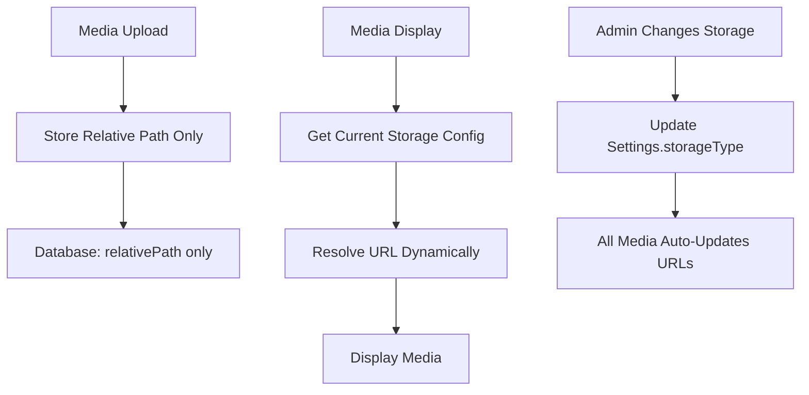

# Storage-Agnostic Media System

## Overview

This system allows dynamic switching between storage providers (LOCAL, S3, DOSPACE) without breaking existing media files. All media URLs are resolved dynamically based on the current storage configuration in the `Settings` table.

## Key Design Principles

### ✅ **Storage Independence**
- Media table stores only **relative paths** (e.g., `"images/filename.webp"`)
- URL resolution happens at **display time** using current storage settings
- No storage provider information locked to individual files

### ✅ **Dynamic URL Resolution**
- URLs constructed based on `Settings.storageType` 
- Same file can be served from different domains when storage changes
- Batched URL resolution for performance

### ✅ **Seamless Switching**
Storage providers can be changed without:
- Database migrations
- File path updates  
- Broken media references

## Architecture



## URL Resolution Flow

1. **Media Component** receives relative path: `"images/user123-prompt-abc.webp"`
2. **BatchedMediaResolver** batches requests for performance
3. **API Route** `/api/media/resolve` handles resolution
4. **Storage Config** retrieved from `Settings` table (cached 5min)
5. **URL Construction** based on current `storageType`:

### S3 Configuration
```typescript
// Priority: CloudFront → Direct S3
if (config.s3CloudfrontUrl) {
  return `${config.s3CloudfrontUrl}/${relativePath}`;
}
return `https://${config.s3BucketName}.s3.${config.s3Region}.amazonaws.com/${relativePath}`;
```

### DigitalOcean Spaces
```typescript
// Priority: CDN → Direct DO Spaces
if (config.doCdnUrl) {
  return `${config.doCdnUrl}/${relativePath}`;
}
return `https://${config.doSpaceName}.${config.doRegion}.digitaloceanspaces.com/${relativePath}`;
```

### Local Storage
```typescript
return `${config.localBaseUrl}/${relativePath}`;
// Results in: /uploads/images/filename.webp
```

## Benefits

### 🔄 **Zero-Downtime Switching**
Change storage providers instantly without affecting existing content.

### 🎯 **Performance Optimized**
- Batched URL resolution (50ms debounce)
- Multi-level caching (30min URL cache, 5min config cache)
- Minimal database queries

### 🔒 **Secure Preview Handling**
Preview images served through `/api/media/preview/[...path]` with proper content-type validation.

### 📦 **Storage Flexibility**
Easy migration between providers:
- Local development → S3 production
- S3 → DigitalOcean Spaces
- Any combination without data loss

## Migration Guide

### From Legacy System
If you had `Media.storageType` field storing per-file storage info:

1. **✅ Completed**: Removed `storageType` column from `Media` table
2. **✅ Completed**: Updated upload endpoints to not store `storageType`
3. **✅ Completed**: Updated TypeScript interfaces
4. **✅ Completed**: Applied database migration

### Switching Storage Providers

1. **Configure New Provider** in admin dashboard
2. **Update Settings** → Storage Configuration  
3. **Test Upload** a new file to verify configuration
4. **Switch Storage Type** → All existing media automatically resolves to new URLs

### Example Scenario
```bash
# Before: Files uploaded to S3
# Media URLs: https://cdn.example.com/images/file.webp

# Admin switches to DigitalOcean Spaces
# Same files now resolve to: https://cdn.digitalocean.com/images/file.webp

# No database changes needed!
```

## File Organization

### Database Schema
```prisma
model Media {
  id           String   @id @default(uuid())
  filename     String   @unique
  relativePath String   // ✅ Only this matters for URL resolution
  // ... other fields
  // ❌ NO storageType field
}

model Settings {
  storageType String   // ✅ Controls ALL media URL resolution
  // ... storage provider configs
}
```

### File Paths
```
Stored in DB: "images/user123-prompt-abc.webp"
Resolved to:
- S3:       "https://cdn.example.com/images/user123-prompt-abc.webp"  
- DOSPACE:  "https://cdn.digitalocean.com/images/user123-prompt-abc.webp"
- LOCAL:    "/uploads/images/user123-prompt-abc.webp"
```

## Implementation Details

### Components Updated
- ✅ `components/media-display.tsx` - Uses batched resolver
- ✅ `lib/image/storage.ts` - Removed storageType from UploadResult
- ✅ `lib/image/path.ts` - Dynamic URL construction
- ✅ `app/api/media/resolve/route.ts` - Batched resolution endpoint
- ✅ Upload APIs - No longer store storageType

### Performance Features
- **Batched Requests**: Multiple URL resolutions in single API call
- **Caching**: URL cache (30min) + Config cache (5min)
- **Rate Limiting**: Prevents abuse of resolution endpoints
- **Error Handling**: Graceful fallbacks for invalid configurations

## Best Practices

### ✅ Do
- Always use relative paths in database
- Let the system resolve URLs dynamically
- Test uploads after changing storage providers
- Monitor storage configuration validity

### ❌ Don't
- Store full URLs in database
- Hard-code storage provider domains
- Skip testing after provider changes
- Store storage type per-file

This system ensures your media continues working regardless of where files are physically stored, providing ultimate flexibility for your storage architecture. 